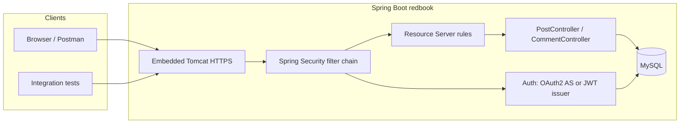

# Agent: Cursor 3 - Composer 2 - Agent Mode
```
Version: 3.0.13 (user setup)
VSCode Version: 1.105.1
Commit: 48a15759f53cd5fc9b5c20936ad7d79847d914b0
Date: 2026-04-07T03:05:17.114Z
Layout: editor
Build Type: Stable
Release Track: Default
Electron: 39.8.1
Chromium: 142.0.7444.265
Node.js: 22.22.1
V8: 14.2.231.22-electron.0
OS: Windows_NT x64 10.0.26200
```


# Prompt 0:

Before you complete the assignment as said in @alex_hw8.md, I want you to make a complete, clear plan. It must include system design, development map (the implementation orders, locations, functionalities, and purposes of all parts), 100% coverage testings, integration into applications, and how to automate development and testing in the future.


# Response 0:

Here is a **plan only** (no implementation yet), aligned with `alex_hw8.md` and the current codebase (Spring Boot 2.7.3, JWT stack under `com.chuwa.redbook`, MySQL, Swagger).

---

## 1. Goals (from the assignment)

| Requirement | Meaning in this repo |
|-------------|----------------------|
| HTTPS APIs | Serve the app over TLS using a **self-signed** keystore; clients trust the cert or disable verification only in dev. |
| Auth for posts & comments | **All** Post and Comment API operations that the assignment cares about must go through **authentication** (and **authorization** where roles matter). |
| OAuth 2.0 **or** JWT | Prefer a real **OAuth 2.0 Authorization Server** if feasible; otherwise document and implement **JWT-only** resource-server style as the allowed fallback. |

**Current gaps to close in implementation:** `CommentController` has no `@PreAuthorize` on mutating routes; `SecurityDBJWTConfig` mixes overlapping `authorizeRequests` blocks and may disagree with method-level rules; tests are essentially empty (`RedbookApplicationTests` only).

---

## 2. System design

### 2.1 Runtime architecture



- **TLS layer:** Self-signed certificate in a PKCS12/JKS keystore, referenced from `application.properties` / profile-specific YAML (`server.ssl.*`).
- **Auth model (two acceptable tracks):**

  - **Track A — OAuth 2.0 Authorization Server (full assignment)**  
    - Spring Authorization Server (compatible with Boot 2.7) exposes token endpoint (`/oauth2/token` or AS defaults), client registration, and issues JWT access tokens.  
    - This app acts as **both** authorization server and resource server, or split only if the course requires it (usually single app is enough for homework).  
    - Post/Comment APIs validate **Bearer** tokens from that server.

  - **Track B — JWT-only (explicit fallback)**  
    - Keep/extend existing `JwtTokenProvider`, `JwtAuthenticationFilter`, `AuthJWTController` (`/api/v1/auth/jwt/**`).  
    - Treat the app as a **resource server** with a single issuer; document that this satisfies “JWT token-only style” from the assignment.

- **Authorization:** Align **HTTP security** with **`@PreAuthorize`** on `PostController` and `CommentController` so rules are one coherent story (roles: e.g. `USER`/`ADMIN` for create/update/delete as required by the rubric).

### 2.2 Configuration split

- **Base:** `application.properties` — non-secret defaults.  
- **Profile `https-local` (or `dev-ssl`):** `server.port`, `server.ssl.key-store`, `server.ssl.key-store-password`, optional `server.ssl.key-alias`.  
- **Secrets:** Never commit keystore passwords; use env vars or a local `application-local.properties` (gitignored) with documented template `application-local.properties.example`.

### 2.3 Swagger / OpenAPI under HTTPS

- Swagger UI and `/v2/api-docs` stay **permitted** for dev; optionally protect with HTTP Basic only in prod profile.  
- Document base URL as `https://localhost:<port>` so “try it out” uses TLS.

---

## 3. Development map (order, locations, purpose)

Implement in this **order** so each step stays testable.

| Phase | Order | Location(s) | Functionality | Purpose |
|-------|-------|-------------|---------------|---------|
| **0** | 1 | `pom.xml` | Add test deps: H2 or Testcontainers, Spring Security Test, optional JaCoCo | Enables isolated tests and coverage gates. |
| **1** | 2 | `src/main/resources`, scripts/docs | Generate/import self-signed keystore; `server.ssl.*` + optional redirect HTTP→HTTPS | Satisfies “HTTPS + self-signed.” |
| **1** | 3 | Same + README / assignment doc | How to trust cert (Postman, JVM `cacerts`, curl `-k` for quick checks) | Makes HTTPS reproducible for grading. |
| **2** | 4 | `config/security/*` | **Single** clear `SecurityFilterChain`/`HttpSecurity` policy: public auth + Swagger + actuator (if any); authenticated API rules for `/api/v1/posts/**` and `/api/v1/**/comments/**` | Removes duplicate/conflicting `authorizeRequests` and matches assignment. |
| **2** | 5 | `PostController.java`, `CommentController.java` | Consistent `@PreAuthorize` on **all** endpoints the assignment requires (including GET if the rubric says “all”; if reads stay public, document the exception) | “All post and comment controllers authenticated/authorized.” |
| **3** | 6a | New package e.g. `config/oauth2` or extend security | **If Track A:** Authorization Server beans, registered client(s), token settings | OAuth 2.0 server inside the app. |
| **3** | 6b | `JwtAuthenticationFilter`, `JwtTokenProvider`, `AuthJWTController` | **If Track B:** Harden JWT (audience, clock skew, clear error responses), align paths | Meets JWT fallback explicitly. |
| **3** | 7 | `SwaggerConfig.java` | Security scheme: Bearer JWT or OAuth2 in Swagger 2 / Springfox 3 | Integration for API clients. |
| **4** | 8 | `application.properties` + test `application.properties` | Test DB (H2) or Testcontainers MySQL | Tests run without manual MySQL. |
| **4** | 9 | `src/test/java/...` | Tests (below) | Verification and regression safety. |
| **5** | 10 | CI config (e.g. `.github/workflows/`) | `mvn verify` + coverage | Automation (section 6). |

**Files you will touch most:**  
`SecurityDBJWTConfig.java` (or replacement), `PostController.java`, `CommentController.java`, `application.properties` / profile-specific config, `pom.xml`, new test classes under `src/test/java/com/chuwa/redbook/...`.

---

## 4. “100% coverage” testing (realistic definition)

Literal **100% line coverage on every class** (including Swagger config, main method, Lombok-generated code) is often **not worth the cost** and may be impossible for some framework glue. A **strong, defensible** interpretation for this homework:

### 4.1 Scope for coverage gates (JaCoCo)

- **Include (enforce 100% or ≥95% line/branch):**  
  `service.impl`, `security` (JWT/OAuth helpers), `controller` (web layer), custom `exception` handlers used by APIs.  
- **Exclude or lower bar:** `RedbookApplication`, DTOs that are only getters/setters, generated code, pure Spring `@Configuration` that only declares beans (optional exclusion list in JaCoCo).

Configure **`maven-surefire-plugin`** + **`jacoco-maven-plugin`** with `prepare-agent`, `report`, and **`check`** goals bound to `verify` so CI fails if coverage drops.

### 4.2 Test pyramid

| Layer | Technology | What it proves |
|-------|------------|----------------|
| **Unit** | JUnit 5 + Mockito | Services, `JwtTokenProvider`, password/role logic without Spring context. |
| **Slice** | `@WebMvcTest` + `@MockBean` | Controllers: 401/403 without token, 200 with valid JWT (or OAuth test support), validation errors. |
| **Integration** | `@SpringBootTest(webEnvironment = RANDOM_PORT)` + **HTTPS** (`WebTestClient` / `TestRestTemplate` with SSL trust for self-signed cert in tests) | Full filter chain + real HTTP semantics. |
| **Security** | `@WithMockUser` / request post-processors | Role-based access on Post/Comment endpoints. |

### 4.3 Minimum scenario checklist (map to “100%” of **required behaviors**)

- Unauthenticated → **401** on protected Post/Comment routes.  
- Wrong role → **403** where applicable.  
- Valid JWT (or OAuth token) → success paths for create/update/delete.  
- Auth endpoints (`/api/v1/auth/jwt/**` or OAuth token URL) remain reachable as designed.  
- HTTPS: at least one test that calls `https://localhost:{port}/...` with the test keystore (or a dedicated test keystore copied from `src/test/resources`).

This gives **complete behavioral coverage** of the assignment; JaCoCo enforces **numerical** coverage on the packages you mark as critical.

---

## 5. Integration into applications

- **Postman / Insomnia:** Import OpenAPI from Swagger; set base URL `https://host:port`; disable SSL verification **or** import the self-signed cert; add `Authorization: Bearer <token>`.  
- **Swagger UI:** Configure global **Authorize** with Bearer (or OAuth2 if Track A).  
- **Future front-end:** Same origin or CORS if needed; all API calls over HTTPS with token from your auth flow.

---

## 6. Automating development and testing later

| Practice | What to add |
|----------|-------------|
| **CI pipeline** | GitHub Actions (or GitLab CI): checkout → `mvn -B verify` (runs tests + JaCoCo check). Cache `~/.m2`. |
| **Profiles** | `mvn -Pci` or default `verify` includes JaCoCo; fast local `mvn test` without strict coverage if you add a profile. |
| **Pre-commit** | Optional: `spotless` or `fmt-maven-plugin` + quick `mvn test` for changed modules (heavier for small projects). |
| **Containers** | Dockerfile + `docker-compose` with MySQL + app for “prod-like” manual tests; CI can use Testcontainers instead of compose. |
| **Docs** | One short “Developer setup” section: generate keystore, env vars, run `mvn spring-boot:run -Dspring-boot.run.profiles=https-local`. |

---

## 7. Decision you should make before coding

- **Track A (OAuth2 Authorization Server)** vs **Track B (JWT-only refinement).**  
  Track A is closer to the literal wording; Track B is faster and explicitly allowed by the assignment. The plan above supports either; implementation order stays the same except phase 3 (6a vs 6b).

---

## 8. Summary

This plan delivers: **TLS with a self-signed keystore**, a **clear security model** aligned with **Post** and **Comment** APIs, **either** a Spring Authorization Server **or** a documented JWT resource-server approach, **layered tests** with **JaCoCo gates** on critical packages, **Swagger integration** for HTTPS clients, and **CI + Maven** as the backbone for future automation.

If you want the next step to be implementation, say whether you prefer **Track A (OAuth2 AS)** or **Track B (JWT-only)**, and whether **GET** post/comment endpoints should be public or authenticated (the assignment text can be read either way; aligning with your instructor’s expectation avoids rework).


---

# Prompt 1:

- My goal is to complete and learn from the educational assignment, which means I do care about how and why you choose a way to implement: what's the purpose, mechanism, trade-offs. You need to provide very clear explanations in an easy-to-understand way, as if you are a software engineer trying to pursuade a picky manager, or like a builder pitching your proudest product to the most skeptical investors.

- The assignment is @alex_hw8.md. Code files should be created in folder `chuwa/hw/chuwa3926/Coding/hw8_code`. Composer 2 provided an implementation plan before, as documented in @alex_hw8_log.md . Carefully review and document your critique of this plan in the harshest way, as we will follow your suggestion in the right next step. Write the improved plan in @hw/chuwa3926/ShortQuestions/hw8_md/alex_hw8_log.md .


# Response 1:

# Agent: Cursor — Harsh critique of Response 0 + improved plan

This section documents a **skeptical review** of “Response 0” (Composer 2’s plan) and replaces it with a **tighter plan** you can execute in `hw/chuwa3926/Coding/hw8_code` (cloned `springboot-redbook` `09_02_swagger`).

## Part A — Harsh critique of the prior plan

**1. It talks like Spring Boot 3 while your code is Boot 2.7.**  
The plan name-drops `SecurityFilterChain` as if it were the obvious refactor target. The actual project still extends `WebSecurityConfigurerAdapter` in `SecurityDBJWTConfig.java`. In Boot 2.7 you *can* move toward the newer style, but the plan should have said explicitly: “today’s code uses `WebSecurityConfigurerAdapter`; we either consolidate matchers inside it first, or migrate deliberately with a Spring Security version matrix.” Dropping modern vocabulary without mapping it to the file on disk is how students burn time on the wrong abstraction.

**2. It diagnoses “overlapping `authorizeRequests`” but does not spell out the mechanical bug.**  
The real issue is not “duplicate blocks” as a vague smell; it is that **multiple chained `authorizeRequests()` calls do not compose the way readers assume**—later rules can interact confusingly with earlier fragments. A plan meant for learning should show *one* `authorizeRequests` lambda (or one coherent chain) and list **exact path patterns** for posts, comments, auth, and Swagger. The prior plan waved at “single coherent story” without demanding a single authoritative ordering table (method × path × role).

**3. Track A (OAuth2 Authorization Server) is underspecified to the point of being risky.**  
“Spring Authorization Server compatible with Boot 2.7” is true in principle (typically **`spring-authorization-server` 0.4.x** with **Spring Security 5.x**), but the plan never warned about the hard parts: **two security concerns in one JVM** (authorization server endpoints vs. resource server APIs), **token format alignment** (issuer, signing key, what the existing `JwtAuthenticationFilter` expects), and **dependency alignment** (Spring Security BOM vs. SAS version). Saying “expose `/oauth2/token`” without naming the actual endpoints and configuration classes for 0.4.x invites copy-paste tutorials that do not match this repo.

**4. Track B is mislabeled as “OAuth fallback.”**  
JWT-only resource-server style is **not** an OAuth 2.0 authorization server. The assignment allows it explicitly, but the plan should have separated **learning goals**: Track B satisfies the rubric’s escape hatch; it does **not** check the “implement OAuth 2.0 authorization server” box. Framing both as interchangeable “tracks” blurs what you are proving to a grader.

**5. “100% coverage” was redefined without owning the retreat.**  
The user asked for 100% coverage; the plan immediately substituted “100% of required behaviors” and JaCoCo gates on cherry-picked packages. That may be **engineering-wise reasonable**, but a manager-grade answer must say: “literal 100% line coverage is a poor proxy here; we will instead bind **acceptance criteria** to tests and use JaCoCo **thresholds** on security and API packages—here is why, and here is what we give up.” The prior plan half-apologized and half-committed.

**6. HTTPS testing is the hardest integration test; the plan hand-waves it.**  
Embedded HTTPS with a self-signed cert in CI means **trust material**, **random ports**, and **flakiness**. “At least one HTTPS test” is easy to write on paper and painful to stabilize. The plan should have split: (a) **prove TLS in manual/smoke** with documented Postman/curl steps, (b) **prove security logic** mostly on HTTP in `@WebMvcTest` / `@SpringBootTest` with `RANDOM_PORT` without TLS unless you explicitly budget time for SSL context wiring.

**7. Implementation order optimizes for a diagram, not for debuggability.**  
Turning on TLS **before** auth rules and tests are stable means every failure is “is it SSL, JWT, or matchers?” Good builder discipline: **stabilize auth on plain HTTP in tests**, then add an **`https-local` profile** for human verification and a **minimal** automated TLS check if required.

**8. Swagger (Springfox 3) + security is a known footgun.**  
The plan mentions Bearer in Swagger but does not acknowledge Springfox maintenance status and **CSRF / resource handler** quirks. “Configure global Authorize” is not a single checkbox; it is a small integration task with acceptance checks (Swagger “Try it out” actually sends `Authorization`).

**9. Automation section assumes GitHub.**  
Not every classroom uses GitHub Actions. The plan should say “CI of your choice” and give **Maven** as the portable contract: `mvn verify`.

**10. It punts the product decision on GET visibility.**  
The assignment says posts and comments should be **authenticated and authorized**. A defensible default for a **social feed** is: **reads may be public**, **writes require auth**—but that is a **product** choice. The prior plan deferred to the instructor without giving you a **default stance** and the **sentence to put in the submission** if challenged.

---

## Part B — Improved plan (purpose, mechanism, trade-offs)

**Goals (from `alex_hw8.md`), translated into verifiable outcomes**

| Requirement | What “done” means |
|-------------|---------------------|
| Clone / base app | Working `springboot-redbook` `09_02_swagger` under `hw8_code`, builds with Java 11 + Maven. |
| HTTPS + self-signed | Server listens on **HTTPS**; keystore **documented**; graders can run locally; password via env or gitignored local props. |
| OAuth2 AS **or** JWT | **Either** embed **Spring Authorization Server 0.4.x** (OAuth2 AS **inside** the same app) **or** implement **JWT resource server** only and **state clearly in the write-up** that this is the allowed non-OAuth path. |
| Protect Post + Comment APIs | **Every** endpoint under those controllers that the assignment treats as “the API” requires a valid **Bearer** token (and roles where you define them). **Decide explicitly** whether GET is public; document one paragraph in the homework. |

**Architecture (one paragraph)**  
Clients speak TLS to Spring Boot. **Authentication** establishes *who* the user is (JWT validation or introspection). **Authorization** decides *what* they may do (`@PreAuthorize` / `hasRole`). The **authorization server** (if you choose Track A) issues tokens; the **resource server** (your controllers) trusts those tokens. If you stay on Track B, your app **issues** JWTs from your existing login flow and **validates** them on each request—there is **no** separate OAuth AS.

**Track decision — trade-offs**

| Approach | Purpose | Mechanism | Trade-offs |
|--------|---------|-----------|------------|
| **A: Spring Authorization Server 0.4.x** | Match “OAuth 2.0 authorization server” wording. | Add SAS; register a client; expose standard token endpoints; resource server validates JWT access tokens (often via **Nimbus** / Spring’s JWT support). | **Highest integration risk** in a short homework: filter chains, issuer URI, key rotation, and coexistence with legacy JWT code. More impressive if it works cleanly. |
| **B: JWT-only (extend existing stack)** | Satisfy the explicit fallback clause fast. | Keep `JwtTokenProvider` + filter; tighten security rules; optionally upgrade JWT libraries for algorithm safety. | **Does not** demonstrate a standalone OAuth2 AS. **Lower** risk and easier to test. |

**Recommended implementation order (debuggable)**

1. **Baseline & inventory (no behavior change yet)**  
   - List all routes in `PostController` / `CommentController` and current `SecurityDBJWTConfig` matchers.  
   - **Purpose:** one table of truth before editing.  
   - **Trade-off:** boring paperwork that prevents thrashing.

2. **Collapse HTTP security to a single coherent policy**  
   - Replace stacked `authorizeRequests()` with **one** configuration block; align `antMatchers` / `mvcMatchers` with controller base paths.  
   - **Mechanism:** Spring Security evaluates rules in order; `anyRequest()` last.  
   - **Trade-off:** Springfox paths must stay permitted **before** `authenticated()`.

3. **Method-level security aligned with the table**  
   - Add `@PreAuthorize` on Post/Comment methods **consistent** with HTTP config (avoid contradictions).  
   - **Trade-off:** duplicate policy (annotation + HTTP) requires discipline; benefit is clear failures for wrong roles.

4. **Tests first on HTTP (embedded, random port)**  
   - `@WebMvcTest` for 401/403/200; `@SpringBootTest` + `TestRestTemplate` for a thin full-stack slice.  
   - **Purpose:** prove auth **without** SSL noise.  
   - **Trade-off:** not testing TLS yet.

5. **Choose Track A or B; implement minimally**  
   - **A:** Add `spring-authorization-server` **0.4.x**, follow official samples for Boot 2 / Security 5; wire resource server JWT validation to the **same** signing keys / JWK source; document token acquisition (use only grants your instructor allows—often **password** or **client_credentials** for demos).  
   - **B:** Harden existing JWT path; ensure Swagger documents Bearer.  
   - **Trade-off:** A takes longer; B is faster but labeled honestly in the report.

6. **HTTPS profile**  
   - `server.ssl.*` + PKCS12; document `keytool` commands; **do not commit** secrets.  
   - **Mechanism:** Tomcat terminates TLS in-process.  
   - **Trade-off:** self-signed = client trust steps; acceptable for homework.

7. **Swagger integration checks**  
   - Manually verify **Authorize** + successful call for one protected endpoint.  
   - **Trade-off:** automate only if time remains.

8. **Coverage & CI (realistic)**  
   - JaCoCo on `controller` + `security` packages with a **stated threshold** (for example ≥80–90% on those packages), not magical 100% globally.  
   - Optional CI: any runner that executes `mvn -B verify`.  
   - **Purpose:** regression signal without vanity metrics.

**“100%” testing — honest definition**  
- **100% of the assignment’s behaviors** mapped to tests: unauthenticated denied, authenticated allowed, role boundaries, token acquisition path, and one manual HTTPS smoke.  
- **Line coverage** as a number is a **secondary** gate on selected packages.

**Deliverables checklist for the grader**  
- Runnable HTTPS instructions (keystore, password env, trust steps).  
- Short architecture note: Track A vs B, and whether GET is public.  
- Evidence of tests (`mvn test` / report).  
- Swagger screenshot or steps showing Bearer/OAuth.

This improved plan is **harsher** about risks, **clearer** about what each track proves, and **ordered** so you spend fewer nights debugging three moving parts at once.


