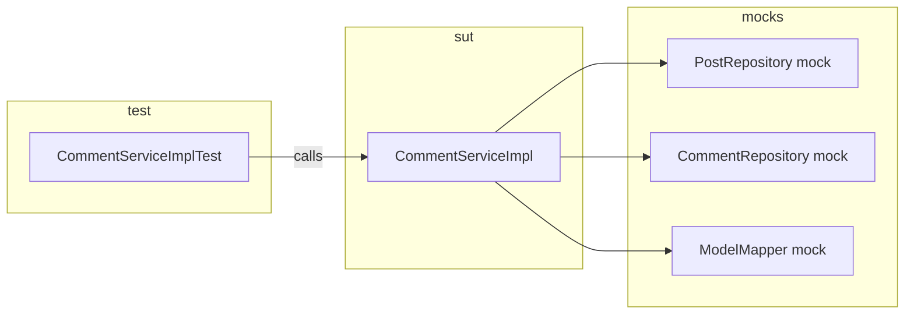

# HW 9

- alex_shen
- 2026-4-10
- Homework 9
- Topics Covered:
    - Testing types (unit → UAT), deployment environments (dev → prod)
- Submission: Submit your answers as a single document or code files

# Conceptual Questions

Explain and compare following concepts, provide specific examples when doing comparison:

## Q1. Testing related:

**How to remember the map:** *Unit* = smallest piece; *Integration* = pieces wired together; *Functional* = “does the feature behave as specified?”; *E2E* = full user journey through real-ish stack; *Regression* = “did we break old stuff?”; *Smoke* = “is it basically alive?”; *Performance* = speed/capacity under expected load; *Stress* = breaking point; *A/B* = product experiment on users; *UAT* = business sign-off.

---

### 1. Unit Testing

- **Purpose:** Prove one function/class/module behaves correctly in isolation (fast feedback, pinpoints bugs).
- **Mechanism:** Call code directly with inputs; assert outputs/side effects; mocks/stubs for dependencies (DB, HTTP, clock).
- **Trade-offs:** Very fast and precise, but can pass while integrations fail; over-mocking can hide real integration bugs.

**Example:** `calculateTax(price, rate)` returns correct cents; `UserValidator` rejects invalid email.

---

### 2. Functional Testing

- **Purpose:** Verify the system meets **functional requirements** (what it should do), often from a black-box perspective.
- **Mechanism:** Drive the app through its public interface (API, UI) with scenarios; compare actual vs expected behavior.
- **Trade-offs:** Closer to user value than raw units, but slower/flakier than unit tests; scope can blur with integration/E2E.

**Example:** “POST `/orders` with valid cart returns 201 and order id”; “Login with wrong password shows error message.”

---

### 3. Integration Testing

- **Purpose:** Verify **multiple components work together** (service + DB, API + message queue, two microservices).
- **Mechanism:** Use real or test doubles for boundaries; often test containers or a shared test DB; fewer mocks than unit tests.
- **Trade-offs:** Catches wiring/schema/contract bugs unit tests miss; slower, more setup, harder to debug than unit tests.

**Example:** Repository saves a row and can read it back; payment service calls sandbox gateway and handles timeout.

---

### 4. Regression Testing

- **Purpose:** Ensure **new changes did not break existing behavior** (safety net over time).
- **Mechanism:** Re-run a curated suite (often automated unit + integration + selected E2E) on every PR or nightly; compare results to baseline.
- **Trade-offs:** Essential for velocity at scale; suite can grow heavy—needs prioritization, parallelization, and flaky-test discipline.

**Example:** After refactoring auth, all old auth tests still green; visual snapshot for checkout page unchanged.

---

### 5. Smoke Testing

- **Purpose:** **Very quick** check that a build is not catastrophically broken before deeper testing or promotion.
- **Mechanism:** Minimal critical path (app starts, health check, login, one core transaction); minutes, not hours.
- **Trade-offs:** Cheap gate, but shallow—passing smoke ≠ quality; choose paths that cover “if this fails, nothing else matters.”

**Example:** After deploy to staging: homepage loads, DB connection OK, “create draft post” works once.

---

### 6. Performance Testing

- **Purpose:** Validate **speed, throughput, latency, resource usage** under **expected** load (SLAs/SLOs).
- **Mechanism:** Load tools (e.g. JMeter, k6); define scenarios (RPS, think time); measure p50/p95/p99, CPU, memory, DB query time.
- **Trade-offs:** Finds bottlenecks before users do; needs representative data and environment or results mislead; not about correctness of business rules.

**Example:** “Under 500 concurrent users, p95 API latency < 200 ms”; “Batch job finishes within 1 hour.”

---

### 7. Stress Testing

- **Purpose:** Find **limits and failure modes** by pushing **beyond** normal load (stability, degradation, recovery).
- **Mechanism:** Ramp traffic until errors/timeouts; may include chaos (kill nodes, disk full); observe backpressure, circuit breakers, autoscaling.
- **Trade-offs:** Reveals breaking point and resilience; can be destructive—use isolated env; different intent than “happy path” performance test.

**Example:** Spike to 10× traffic until queue backs up; verify no data corruption and graceful errors when DB pool exhausted.

---

### 8. A/B Testing

- **Purpose:** **Product/experiment** testing: compare two variants on **real users** to optimize metrics (conversion, retention).
- **Mechanism:** Feature flags + random assignment + metrics; statistical analysis (significance, sample size); guardrails (errors, latency).
- **Trade-offs:** Data-driven decisions; ethical/consent issues, confounding variables, and “peeking” at results too early can mislead—not a substitute for engineering tests.

**Example:** 50% users see new checkout button color; measure completion rate for two weeks.

---

### 9. End-to-End Testing (E2E)

- **Purpose:** Validate **full user journeys** across UI/API, backend, DB, queues—closest to “real user” in automation.
- **Mechanism:** Browser automation (Playwright/Cypress) or multi-step API scripts against staging-like stack; seed test data.
- **Trade-offs:** High confidence for critical paths; slow, brittle (timing, selectors), expensive to maintain—use sparingly on top of unit/integration.

**Example:** “Sign up → verify email → place order → see order in account history” in browser.

---

### 10. User Acceptance Testing (UAT)

- **Purpose:** **Business/customer** confirms the system **meets agreed requirements** and is acceptable to release (“definition of done” from user view).
- **Mechanism:** Scripted scenarios with real stakeholders (or pilot customers) in pre-prod; sign-off checklist; may include legal/compliance checks.
- **Trade-offs:** Catches misunderstanding of requirements early; subjective, manual, scheduling-heavy—not a replacement for automated regression.

**Example:** HR approves payroll export format before go-live; client runs UAT on staging and signs contract milestone.

---

### Quick comparison table (interview sound bite)

| Type | Main question | Scope | Typical speed |
|------|----------------|-------|----------------|
| Unit | Does this small piece work? | One module | Fastest |
| Integration | Do parts connect correctly? | Subsystem | Medium |
| Functional | Does behavior match spec? | Feature/API | Medium–slow |
| E2E | Does the full journey work? | Whole stack | Slowest |
| Regression | Did we break anything old? | Any of above | Depends on suite |
| Smoke | Is this build basically OK? | Critical slice | Very fast |
| Performance | Is it fast enough at expected load? | System under load | Slow (runs) |
| Stress | Where does it break? | Beyond normal load | Slow, risky |
| A/B | Which product variant wins? | Live users + metrics | Ongoing |
| UAT | Will the customer accept it? | Human + scenarios | Manual |

---

## Q2. Environment related:

**How to remember:** Data and risk increase as you move **Dev → QA → Staging → Prod**. Code flows **left to right**; only prod serves real customers with real consequences.

---

### 1. Development

- **Purpose:** Individual engineers integrate and debug **locally or in personal sandboxes** without blocking others.
- **Mechanism:** Local machine, Docker, or personal cloud namespace; often points to dev DB; hot reload; verbose logging; may use fake APIs.
- **Trade-offs:** Fastest iteration, safest to break; least like production (data, scale, config), so “works on my machine” risk.

**Example:** Developer runs Spring Boot + local Postgres with seed script; feature branch deployed to `dev-alex.example.com`.

---

### 2. QA (Quality Assurance)

- **Purpose:** Dedicated place for **testers (and sometimes devs)** to run functional/regression/exploratory tests **before** wider release.
- **Mechanism:** Shared server(s); test data refreshed periodically; bug tracking integrated; may mirror prod topology loosely.
- **Trade-offs:** More stable than personal dev; can still differ from prod; contention if many teams share one QA env.

**Example:** QA team executes test plan for sprint release on `qa.example.com` with anonymized copy of schema.

---

### 3. Pre-prod / Staging

- **Purpose:** **Last rehearsal** before production: integration with real-ish dependencies, final smoke, migrations, runbooks, performance checks.
- **Mechanism:** Prod-like config (feature flags off for unreleased features), similar hardware/scaling, often **prod-like data** (masked) or refreshed subset; may receive blue/green or canary deploy first.
- **Trade-offs:** Best predictor of prod issues; expensive to maintain; if staging drifts from prod, false confidence.

**Example:** Run DB migration on staging, verify E2E payment with sandbox PSP, then promote same artifact to prod.

---

### 4. Production

- **Purpose:** **Live system** serving **real users** and **real data**; source of revenue and reputation.
- **Mechanism:** Strict access, monitoring/alerting, backups, DR, change control, SLOs, incident response; minimal experimentation without guardrails.
- **Trade-offs:** Highest correctness and reliability bar; changes are high-stakes—mitigate with feature flags, canary, rollbacks.

**Example:** `app.example.com` with real PII, billing, and 99.9% uptime target.

---

### Environment comparison (interview sound bite)

| Environment | Primary audience | Data | Risk if broken |
|---------------|------------------|------|----------------|
| Development | Engineers | Fake / local | Low (individual) |
| QA | QA + dev | Test / anonymized | Medium (release delay) |
| Staging | Eng + sometimes stakeholders | Prod-like masked | High (miss prod bug) |
| Production | Customers | Real | Very high (money, trust, legal) |

**Typical promotion flow:** Dev (implement) → QA (validate quality) → Staging (prod dress rehearsal) → Production (controlled release + monitor).

**Trade-off across all:** Fidelity to prod vs cost and speed—more fidelity catches more issues later but costs more to run and keep in sync.

# Programming Questions

## Q3. Write unit test for CommentServiceImpl.java: https://github.com/CTYue/springboot-redbook/blob/10_testing/src/main/java/com/chuwa/redbook/service/impl/CommentServiceImpl.java
- This entire repo branch (and the file `CommentServiceImpl.java` included) is downloaded in the folder `Chuwa\hw\chuwa3926\Coding\hw9_code\springboot-redbook-10_testing\springboot-redbook-10_testing`
- Try to cover as many lines/branches as possible.
- Prove your code coverage using Jacoco Report.

### Q3 — Engineering plan (before implementation)

This section is the **design + roadmap** for Q3: what we are building, in what order, how we prove coverage, how it sits in the real app, and how to automate it later.

---

#### 1. System design (testing architecture)

**Goal:** Verify `CommentServiceImpl` **business rules** and **orchestration** (call order, which repository methods run, which exceptions surface) **without** starting MySQL, Tomcat, or the full Spring context.

**Core idea — unit test in the “London / mockist” style (same as existing `PostServiceImplTest`):**

| Piece | Role |
|--------|------|
| **System under test (SUT)** | `CommentServiceImpl` — the class we assert on. |
| **Collaborators (mocked)** | `CommentRepository`, `PostRepository`, `ModelMapper` — replaced by Mockito `@Mock` so behavior is **fully controlled** in each test. |
| **Test runner** | JUnit 5 + `MockitoExtension` — injects mocks into `@InjectMocks CommentServiceImpl`. |

**Why mock repositories instead of `@SpringBootTest` + H2?**

- **Purpose:** Fast, deterministic tests; failures point to **service logic**, not DB wiring or environment.
- **Mechanism:** `when(postRepository.findById(...)).thenReturn(Optional.of(...))` or `Optional.empty()` to simulate found / not found.
- **Trade-off:** We do **not** prove JPA queries or schema here; that would be **integration** tests (e.g. `@DataJpaTest`). For this homework, **unit tests + JaCoCo on the service class** match the assignment and the repo’s existing pattern.

**Data flow (mental model):**

**Exception design (what we assert):**

- `ResourceNotFoundException` — missing post or missing comment (`Optional` empty paths).
- `BlogAPIException` with `HttpStatus.BAD_REQUEST` — comment exists but `comment.getPost().getId()` does not equal the requested post’s id (wrong-post ownership checks in `getCommentById`, `updateComment`, `deleteComment`).

---

#### 2. Development map (implementation order, locations, purposes)

**Repository root:** `hw/chuwa3926/Coding/hw9_code/springboot-redbook-10_testing/springboot-redbook-10_testing/`

| Step | Location | What to add / change | Purpose |
|------|-----------|----------------------|---------|
| **1** | `src/test/java/com/chuwa/redbook/service/impl/CommentServiceImplTest.java` | New test class | Mirror `PostServiceImplTest`: `@ExtendWith(MockitoExtension.class)`, `@Mock` repos + `ModelMapper`, `@InjectMocks` service. |
| **2** | Same file — `@BeforeEach` | Build reusable `Post`, `Comment`, `CommentDto` fixtures (ids aligned for “happy path”) | Reduce duplication; keep tests readable. |
| **3** | `createComment` tests | Stub `modelMapper.map(dto→entity)`, `postRepository.findById` → `Optional.of(post)`, `commentRepository.save` → saved entity, `modelMapper.map(entity→dto)` | Happy path + **post not found** → `ResourceNotFoundException`. |
| **4** | `getCommentsByPostId` tests | `when(commentRepository.findByPostId).thenReturn(emptyList / list)`; stub `modelMapper.map` per element | Cover stream path (0 and N comments). |
| **5** | `getCommentById` tests | Chain: load post, load comment; vary optional empties and **mismatched post** on comment | All branches including `BlogAPIException`. |
| **6** | `updateComment` tests | Same branch matrix as (5), plus assert `setName/Email/Body` effect via `save` argument **Captor** (optional but strong) | Update path + ownership + not found. |
| **7** | `deleteComment` tests | Same branches; `doNothing().when(commentRepository).delete(...)`; `verify(..., times(1)).delete` | Prove delete only when ownership OK. |
| **8** | `commentServiceMapperUtil` | **Static** helper — call with a real `Comment` (and optionally assert non-null `CommentDto` fields) | Uses a **real** `ModelMapper` inside the util; no need to mock; covers lines other tests skip. |
| **9** | `pom.xml` | Already has `jacoco-maven-plugin` with `prepare-agent` + `report` on `test` | Generate HTML report after `mvn test`. Optional later: `jacoco:check` with `counter`/`minimum` for **CommentServiceImpl** only (see below). |

**Recommended test method checklist (maps to branches in source):**

1. `createComment` — success.
2. `createComment` — post id not found.
3. `getCommentsByPostId` — empty list.
4. `getCommentsByPostId` — multiple comments (mapper invoked per item).
5. `getCommentById` — success (same post id on comment’s post and path param).
6. `getCommentById` — post not found.
7. `getCommentById` — comment not found.
8. `getCommentById` — comment belongs to **another** post → `BlogAPIException`, assert status `BAD_REQUEST` and message.
9. `updateComment` — repeat (5)–(8) + assert saved comment fields match request (Captor or returned DTO).
10. `deleteComment` — success + `verify(delete)`.
11. `deleteComment` — post not found / comment not found / wrong post (no `delete` verify on error paths).
12. `commentServiceMapperUtil` — maps `Comment` → `CommentDto`.

---

#### 3. “100% coverage” — scope and how we achieve it

**Clarification:** In industry, “100% coverage” almost always means **a chosen scope** (e.g. one module or diff coverage), not “every line in the entire monolith,” which is costly and often low value.

**For this assignment, the meaningful scope is:** **100% line and branch coverage on `CommentServiceImpl` only**, as shown in JaCoCo’s class-level report for that file.

**Mechanism:**

- Run from project root: `mvn clean test` (JaCoCo agent attaches via existing `prepare-agent`; `report` runs in `test` phase).
- Open: `target/site/jacoco/index.html` → navigate to `com.chuwa.redbook.service.impl` → `CommentServiceImpl`.
- If any line stays **red/yellow**, add a test that drives that path (usually another `Optional.empty()` or mismatch case).

**Optional hard gate (future tightening):** add a second `execution` to `jacoco-maven-plugin` with goal `check` and `<includes><include>com/chuwa/redbook/service/impl/CommentServiceImpl.class</include></includes>` plus `<minimum>` for `LINE` and `BRANCH`. **Trade-off:** CI fails on coverage drops (good discipline); config must be maintained when class grows.

---

#### 4. Integration into the application

| Layer | What “integration” means here | Purpose |
|--------|----------------------------------|---------|
| **Maven lifecycle** | `mvn test` runs all `*Test` classes; JaCoCo binds to the same JVM | Same command developers and CI use; no separate “coverage tool” step beyond Maven. |
| **Runtime app** | Unit tests **do not** deploy inside the running Spring Boot app | They validate the **service contract** used by `CommentController` (or others). If controllers break wiring, add **`@WebMvcTest(CommentController.class)`** later — that is **integration** at the web layer, optional stretch goal. |
| **Full stack** | `RedbookApplicationTests` + real DB profile | **E2E / integration**; out of scope for “unit test CommentServiceImpl” but valid for a separate pipeline stage. |

**Interview line:** *Unit tests guard the service; controller tests guard HTTP mapping; full app tests guard deployment and infrastructure.*

---

#### 5. Automating development and testing (future)

| Practice | Purpose | Typical tool |
|----------|---------|----------------|
| **CI on every push/PR** | Every change runs `mvn -B test` (and optionally `jacoco:check`) | GitHub Actions, GitLab CI, Jenkins |
| **Coverage report as artifact** | Reviewers see HTML or Cobertura/XML in PR | Upload `target/site/jacoco` or use Codecov/SonarQube |
| **Pre-push hook (local)** | Fast feedback before remote | Husky (Node) or simple `git hook` running Maven; or IDE “run tests before commit” |
| **Matrix** | Java 11 and 17 if library supports | CI `strategy.matrix` |
| **Caching** | Faster `mvn` in CI | `actions/cache` for `~/.m2/repository` |

**Trade-off:** Full CI on every commit costs minutes; **split** fast unit job (no DB) vs slower integration job (Testcontainers/H2) keeps feedback loops short.

---

#### 6. Summary sound bite (for interviews)

We will **isolate** `CommentServiceImpl`, **mock** persistence and mapping, drive **every branch** (found/not found/wrong post), prove it with **JaCoCo HTML**, and later **gate merges** with `jacoco:check` + CI so coverage and behavior do not regress silently.

---

### Q3 — Deliverables (completed)

**Primary deliverable:** `CommentServiceImplTest.java` at  
`hw/chuwa3926/Coding/hw9_code/springboot-redbook-10_testing/springboot-redbook-10_testing/src/test/java/com/chuwa/redbook/service/impl/CommentServiceImplTest.java`

- **17** JUnit 5 tests: `createComment` (success + post missing), `getCommentsByPostId` (empty + multiple), `getCommentById` / `updateComment` / `deleteComment` (success, post missing, comment missing, wrong post → `BlogAPIException`), `commentServiceMapperUtil` (real `ModelMapper`).
- **Style:** `@ExtendWith(MockitoExtension.class)`, `@Mock` on `CommentRepository`, `PostRepository`, `ModelMapper`, `@InjectMocks` on `CommentServiceImpl` (aligned with `PostServiceImplTest`).

**JaCoCo proof (after full `mvn test` on this machine):** open  
`.../springboot-redbook-10_testing/target/site/jacoco/index.html` → package `com.chuwa.redbook.service.impl` → class **CommentServiceImpl**.  
`target/site/jacoco/jacoco.csv` row for `CommentServiceImpl` shows **0** missed instructions/lines/branches and **252** instructions / **37** lines / **6** branches covered → **100%** coverage for that class.

**How to reproduce:** from the project folder, set `JAVA_HOME` to your JDK, then run **`mvnw.cmd test`** (Windows) or **`./mvnw test`**. JaCoCo report is generated in the **`test`** phase by the existing `jacoco-maven-plugin`.

**Supporting changes (so the whole module builds and tests pass without your classroom MySQL):**

| Change | Why |
|--------|-----|
| `pom.xml`: Lombok **1.18.44**, `maven-compiler-plugin` with **`-proc:full`** + Lombok **annotationProcessorPaths** | JDK **25** needs a recent Lombok and explicit annotation processing so `@Slf4j` / `@Data` compile. |
| `pom.xml`: **H2** `test` scope | In-memory DB for tests. |
| `src/test/resources/application.properties` | Overrides MySQL URL with **H2**; adds **JWT** / **pathmatch** props so the Spring context loads in CI. |
| `RedbookApplicationTests`: **`@Transactional`** | Avoids **LazyInitializationException** when `ModelMapper` maps `Post.comments` after `createPost`. |